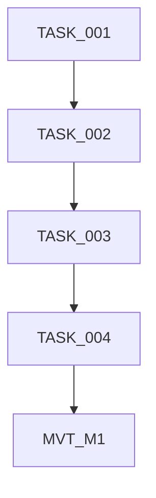
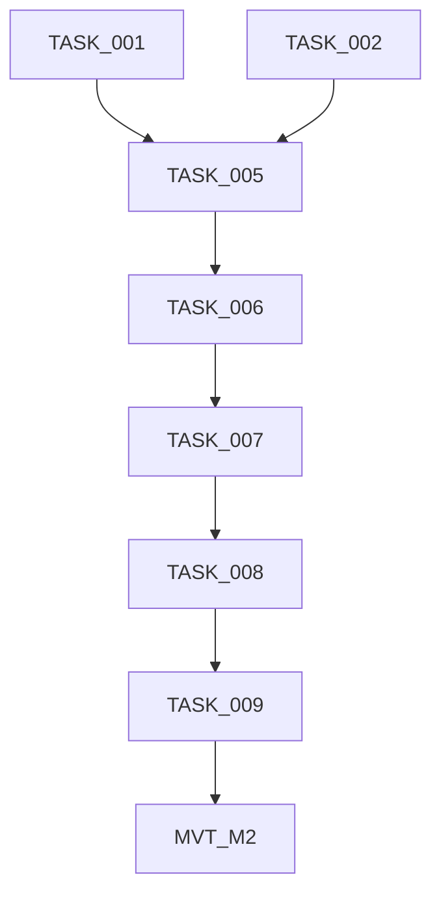
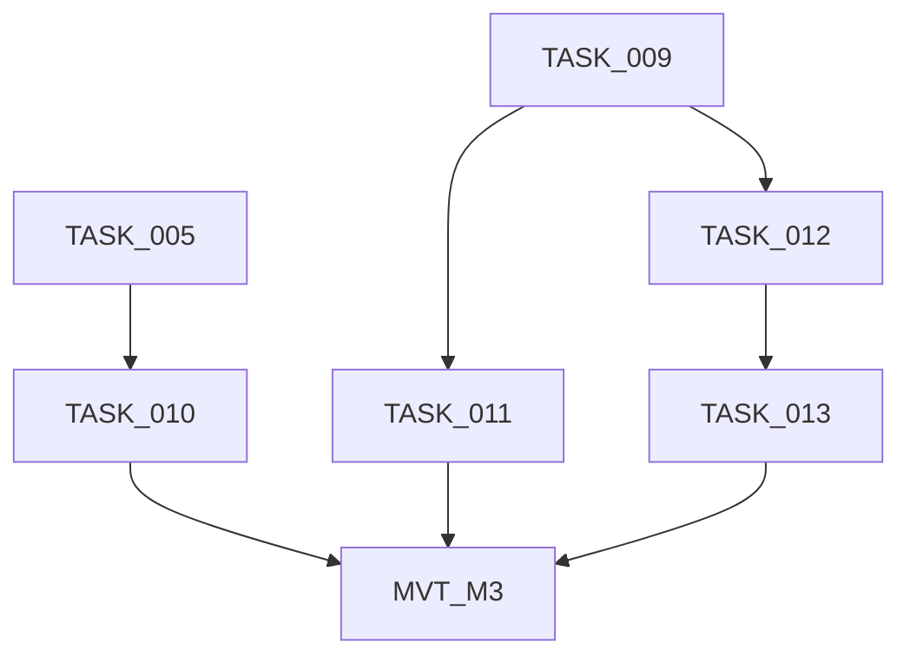

# Yolo Command - Implementation Progress

## Overview

| Property         | Value                                           |
| ---------------- | ----------------------------------------------- |
| **Project Name** | Yolo Command Implementation                     |
| **Plan File**    | docs/yolo_command_implementation_plan.md        |
| **Total Tasks**  | 13 tasks + 3 MVTs                               |
| **Tech Stack**   | TypeScript, Node.js, Commander.js, Vitest       |

---

## Status Legend

| Marker      | Meaning                          |
| ----------- | -------------------------------- |
| COMPLETE    | Task finished and verified       |
| IN PROGRESS | Currently being worked on        |
| IN REVIEW   | Work complete, awaiting review   |
| NOT STARTED | Task not yet begun               |
| BLOCKED     | Waiting on dependency completion |

---

## Progress Summary

| Milestone | Name                         | Tasks   | MVT    | Complete | Total | Status      |
| --------- | ---------------------------- | ------- | ------ | -------- | ----- | ----------- |
| M1        | Foundation                   | 001-004 | MVT_M1 | 3        | 5     | IN PROGRESS |
| M2        | Core Implementation          | 005-009 | MVT_M2 | 0        | 6     | NOT STARTED |
| M3        | Integration and Polish       | 010-013 | MVT_M3 | 0        | 5     | NOT STARTED |

---

## Milestone: M1 - Foundation

| Task ID  | Title                           | File                                   | Status      | Review Status | Priority | Complexity | Dependencies | Assigned To | Attempts |
| -------- | ------------------------------- | -------------------------------------- | ----------- | ------------- | -------- | ---------- | ------------ | ----------- | -------- |
| TASK_001 | YoloOptions Interface           | TASK_001_yolo_options_interface.md     | COMPLETE    | PASSED        | HIGH     | S (≤2h)    | None         | SA-20260220-001 | 1        |
| TASK_002 | Yolo Command Skeleton           | TASK_002_yolo_command_skeleton.md      | COMPLETE    | PASSED        | HIGH     | S (≤2h)    | TASK_001     | SA-20260220-002 | 1        |
| TASK_003 | Command Registry Registration   | TASK_003_command_registry_registration.md | COMPLETE    | PASSED      | HIGH     | S (≤2h)    | TASK_002     | SA-20260220-003 | 1        |
| TASK_004 | CLI Integration Verification    | TASK_004_cli_integration_verification.md | NOT STARTED | —           | MEDIUM   | S (≤2h)    | TASK_003     |             |          |
| MVT_M1   | Foundation Manual Test          | MVT_M1_foundation.md                   | NOT STARTED | —             | —        | 15 min     | TASK_001-004 |             |          |

### Dependencies



---

## Milestone: M2 - Core Implementation

| Task ID  | Title                        | File                                | Status      | Review Status | Priority | Complexity | Dependencies | Assigned To | Attempts |
| -------- | ---------------------------- | ----------------------------------- | ----------- | ------------- | -------- | ---------- | ------------ | ----------- | -------- |
| TASK_005 | Lock Acquisition Logic       | TASK_005_lock_acquisition_logic.md  | COMPLETE    | PASSED        | HIGH     | S (≤2h)    | TASK_001, TASK_002 | SA-20260220-004 | 1        |
| TASK_006 | Plan Phase Execution         | TASK_006_plan_phase_execution.md    | COMPLETE    | PASSED        | HIGH     | M (≤4h)    | TASK_005     | SA-20260220-006 | 2        |
| TASK_007 | Task Phase Execution         | TASK_007_task_phase_execution.md    | COMPLETE    | PASSED        | HIGH     | S (≤2h)    | TASK_006     | SA-20260220-007 | 1        |
| TASK_008 | Run Phase Execution          | TASK_008_run_phase_execution.md     | COMPLETE    | PASSED        | HIGH     | S (≤2h)    | TASK_007     | SA-20260220-008 | 1        |
| TASK_009 | Cleanup and Error Handling   | TASK_009_cleanup_and_error_handling.md | COMPLETE    | PASSED      | HIGH     | M (≤4h)    | TASK_008     | SA-20260220-009 | 1        |
| MVT_M2   | Core Implementation Test     | MVT_M2_core_implementation.md       | NOT STARTED | —             | —        | 30 min     | TASK_005-009 |             |          |

### Dependencies



---

## Milestone: M3 - Integration and Polish

| Task ID  | Title                            | File                                      | Status      | Review Status | Priority | Complexity | Dependencies | Assigned To | Attempts |
| -------- | -------------------------------- | ----------------------------------------- | ----------- | ------------- | -------- | ---------- | ------------ | ----------- | -------- |
| TASK_010 | Status Command Integration       | TASK_010_status_command_integration.md    | NOT STARTED | —             | MEDIUM   | S (≤2h)    | TASK_005     |             |          |
| TASK_011 | Progress Indicators and Polish   | TASK_011_progress_indicators_and_polish.md | NOT STARTED | —            | MEDIUM   | S (≤2h)    | TASK_009     |             |          |
| TASK_012 | Unit Tests                       | TASK_012_unit_tests.md                    | IN REVIEW   |               | HIGH     | M (≤4h)    | TASK_009     | SA-20260220-010 | 1        |
| TASK_013 | Integration Tests                | TASK_013_integration_tests.md             | NOT STARTED | —             | HIGH     | L (≤8h)    | TASK_012     |             |          |
| MVT_M3   | Integration and Polish Test      | MVT_M3_integration_and_polish.md          | NOT STARTED | —             | —        | 30 min     | TASK_010-013 |             |          |

### Dependencies



---

## Completed Milestones

> Summary only. See task files for details.
> **On initial generation, this section should be empty or state "None yet".**

None yet.

---

## Critical Path

```
TASK_001 → TASK_002 → TASK_003 → TASK_004 → MVT_M1 →
TASK_005 → TASK_006 → TASK_007 → TASK_008 → TASK_009 → MVT_M2 →
TASK_012 → TASK_013 → MVT_M3
```

**Estimated remaining**: 35-55 hours (Foundation: 8-10h, Core: 14-20h, Polish: 13-25h)

---

## Risk Areas

| Task     | Risk                              | Mitigation                                  |
| -------- | --------------------------------- | ------------------------------------------- |
| TASK_005 | Lock race conditions              | Use atomic acquireLock(), avoid TOCTOU      |
| TASK_006 | Path validation complexity        | Use PathValidator.isWithinProject() early   |
| TASK_009 | Signal handler cleanup timing     | Register cleanup before lock acquisition    |
| TASK_013 | Integration test flakiness        | Use temp directories, proper cleanup hooks  |

---

## Subagent Tracking

Last Subagent ID: SA-20260220-010

---

## Review Tracking

Last Review ID: RA-20260220-009

---

## Agent Handoff

### For Reviewer

| Field             | Value |
| ----------------- | ----- |
| Task              | TASK_012 |
| Impl Agent        | SA-20260220-010 |
| Files Changed     | `vitest.config.ts` |
| Tests Added       | `test/yolo.test.ts` (22 new tests) |
| Rework?           | No |
| Focus Areas       | Yolo lock lifecycle, path traversal checks, and per-phase option/error propagation in `test/yolo.test.ts` |
| Known Limitations | Coverage threshold config is set to lines/branches; coverage enforcement still depends on running coverage mode |
| Gate Results      | format:✅ lint:✅ typecheck:✅ test:✅ |

### For Fix Agent

| Field           | Value |
| --------------- | ----- |
| Task            | TASK_006 |
| Task Goal       | — |
| Review Agent    | — |
| Failed Gate     | — |
| Primary Error   | — |
| Root Cause Hint | — |
| Do NOT          | — |

---


