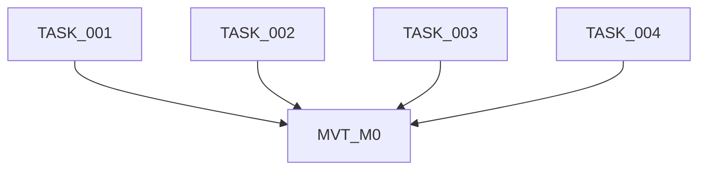
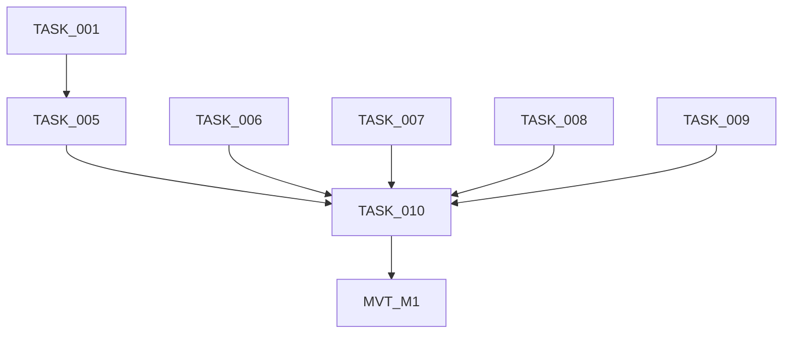
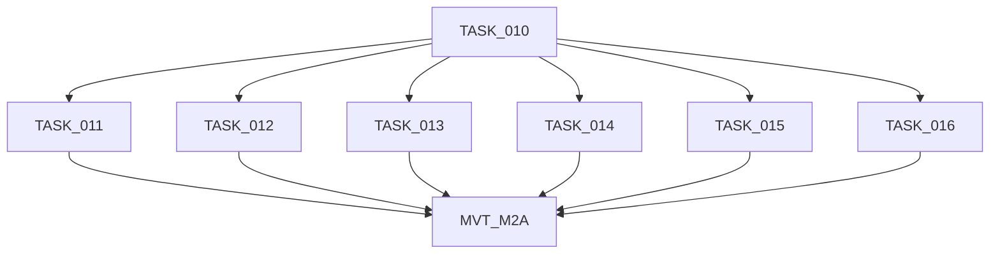
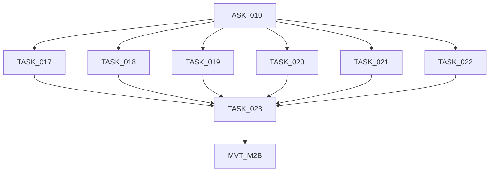
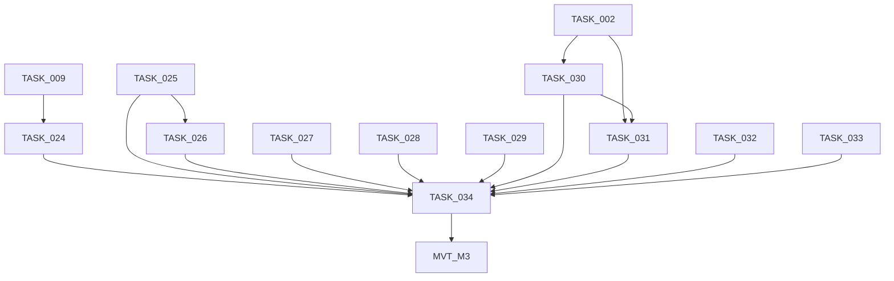
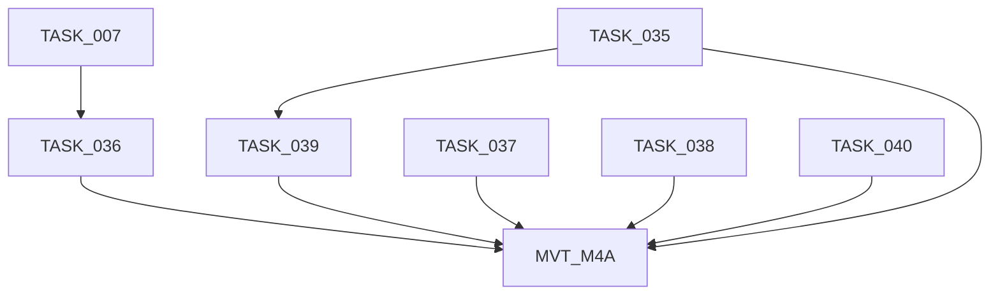
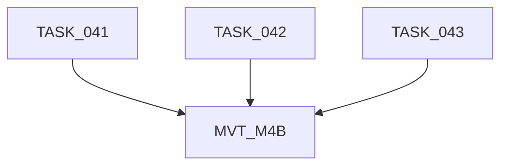
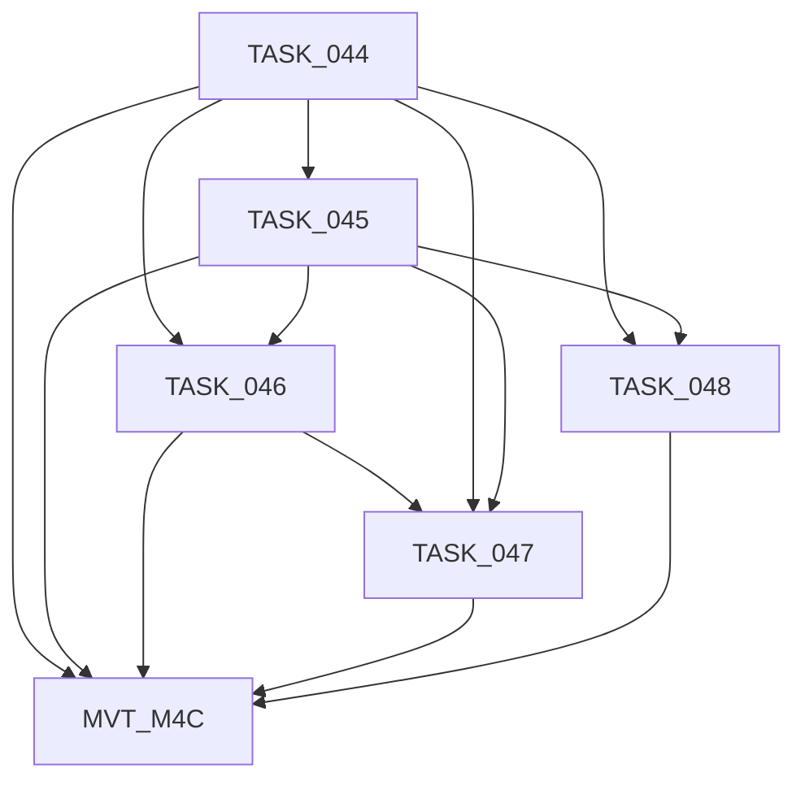

# Speci Codebase Refactoring - Implementation Progress

## Overview

| Property         | Value                                                      |
| ---------------- | ---------------------------------------------------------- |
| **Project Name** | Speci Codebase Refactoring                                 |
| **Plan File**    | docs/REFACTORING_PLAN.md                                   |
| **Total Tasks**  | 48 tasks + 8 MVTs = 56 total                               |
| **Tech Stack**   | TypeScript, Node.js ≥22, ESM, Vitest, Commander.js, ESLint |

---

## Status Legend

| Marker      | Meaning                          |
| ----------- | -------------------------------- |
| COMPLETE    | Task finished and verified       |
| IN PROGRESS | Currently being worked on        |
| IN REVIEW   | Work complete, awaiting review   |
| NOT STARTED | Task not yet begun               |
| BLOCKED     | Waiting on dependency completion |

---

## Progress Summary

| Milestone | Name                          | Tasks   | MVT       | Complete | Total | Status      |
| --------- | ----------------------------- | ------- | --------- | -------- | ----- | ----------- |
| M0        | Quick Wins                    | 001-004 | MVT_M0    | 0        | 5     | NOT STARTED |
| M1        | Critical Fixes                | 005-010 | MVT_M1    | 0        | 7     | NOT STARTED |
| M2A       | Naming Standardization        | 011-016 | MVT_M2A   | 0        | 7     | NOT STARTED |
| M2B       | Type Safety & Error Handling  | 017-023 | MVT_M2B   | 0        | 8     | NOT STARTED |
| M3        | Duplication & Complexity      | 024-034 | MVT_M3    | 0        | 12    | NOT STARTED |
| M4A       | Test Coverage & Isolation     | 035-040 | MVT_M4A   | 0        | 7     | NOT STARTED |
| M4B       | Architecture                  | 041-043 | MVT_M4B   | 0        | 4     | NOT STARTED |
| M4C       | Module Organization           | 044-048 | MVT_M4C   | 0        | 6     | NOT STARTED |

---

## Milestone: M0 - Quick Wins

| Task ID  | Title                                                        | File                                             | Status      | Review Status | Priority | Complexity | Dependencies | Assigned To | Attempts |
| -------- | ------------------------------------------------------------ | ------------------------------------------------ | ----------- | ------------- | -------- | ---------- | ------------ | ----------- | -------- |
| TASK_001 | Hoist VALID_STATUSES/ACTIVE_STATUSES to Module-Level in state.ts | TASK_001_hoist_valid_active_statuses_state.md | COMPLETE    | PASSED        | Medium   | S (≤2h)    | None         | SA-20260224-015 | 1        |
| TASK_002 | Hoist STATE_COLORS/STATE_ICONS to Module-Level in status.ts  | TASK_002_hoist_state_colors_icons_status.md      | NOT STARTED | —             | Medium   | S (≤2h)    | None         |             |          |
| TASK_003 | Cache getDefaults() in config.ts                             | TASK_003_cache_getdefaults_config.md             | NOT STARTED | —             | Medium   | S (≤2h)    | None         |             |          |
| TASK_004 | Cache matrixChars.length in renderer.ts Animation Loop       | TASK_004_cache_matrixchars_length_renderer.md    | NOT STARTED | —             | Medium   | S (≤2h)    | None         |             |          |
| MVT_M0   | Manual Verification: Quick Wins                              | MVT_M0_quick_wins.md                             | NOT STARTED | —             | —        | 30 min     | TASK_001, TASK_002, TASK_003, TASK_004 | | |

### Dependencies


```mermaid
graph TD
    T001[TASK_001] --> MVT[MVT_M0]
    T002[TASK_002] --> MVT
    T003[TASK_003] --> MVT
    T004[TASK_004] --> MVT
```

---

## Milestone: M1 - Critical Fixes

| Task ID  | Title                                                        | File                                                    | Status      | Review Status | Priority | Complexity | Dependencies                                           | Assigned To | Attempts |
| -------- | ------------------------------------------------------------ | ------------------------------------------------------- | ----------- | ------------- | -------- | ---------- | ------------------------------------------------------ | ----------- | -------- |
| TASK_005 | Fix stateFileCache Path Keying Bug                           | TASK_005_fix_statefile_cache_path_keying.md             | COMPLETE    | PASSED        | High     | S (≤2h)    | TASK_001                                               | SA-20260224-016 | 1        |
| TASK_006 | Add Global unhandledRejection/uncaughtException Handlers     | TASK_006_add_global_unhandled_rejection_handlers.md     | COMPLETE    | PASSED        | High     | S (≤2h)    | None                                                   | SA-20260224-001 | 1        |
| TASK_007 | Consolidate isCleaningUp Guard to Single Source              | TASK_007_consolidate_is_cleaning_up_guard.md            | COMPLETE    | PASSED        | High     | S (≤2h)    | None                                                   | SA-20260224-002 | 1        |
| TASK_008 | Fix O(n²) stdout Concatenation in Gate Runner                | TASK_008_fix_on2_stdout_concatenation_gate.md           | COMPLETE    | PASSED        | High     | S (≤2h)    | None                                                   | SA-20260224-003 | 1        |
| TASK_009 | Fix Clean Command Missing try/catch in Registry              | TASK_009_fix_clean_command_try_catch_registry.md        | COMPLETE    | PASSED        | High     | XS (<1h)   | None                                                   | SA-20260224-004 | 1        |
| TASK_010 | Integration — Wire and Verify All M1 Changes                 | TASK_010_integration_wire_m1_changes.md                 | COMPLETE    | PASSED        | High     | M (2-4h)   | TASK_005, TASK_006, TASK_007, TASK_008, TASK_009       | SA-20260224-017 | 1        |
| MVT_M1   | Manual Verification: Critical Fixes                          | MVT_M1_critical_fixes.md                                | NOT STARTED | —             | —        | 30 min     | TASK_010                                               |             |          |

### Dependencies


```mermaid
graph TD
    T001[TASK_001] --> T005[TASK_005]
    T005 --> T010[TASK_010]
    T006[TASK_006] --> T010
    T007[TASK_007] --> T010
    T008[TASK_008] --> T010
    T009[TASK_009] --> T010
    T010 --> MVT[MVT_M1]
```

---

## Milestone: M2A - Naming Standardization

| Task ID  | Title                                       | File                                                               | Status      | Review Status | Priority | Complexity  | Dependencies | Assigned To | Attempts |
| -------- | ------------------------------------------- | ------------------------------------------------------------------ | ----------- | ------------- | -------- | ----------- | ------------ | ----------- | -------- |
| TASK_011 | Standardize forceReload → forceRefresh      | TASK_011_standardize_force_reload_to_force_refresh.md              | COMPLETE    | PASSED        | High     | S (≤2h)     | TASK_010     | SA-20260224-018 | 1        |
| TASK_012 | Rename i18n.ts → formatting.ts              | TASK_012_rename_i18n_to_formatting.md                              | COMPLETE    | PASSED        | High     | S (≤2h)     | TASK_010     | SA-20260224-019 | 1        |
| TASK_013 | Rename normalizeAgentName → buildAgentName  | TASK_013_rename_normalize_agent_name_to_build_agent_name.md        | NOT STARTED | —             | Medium   | S (≤2h)     | TASK_010     |             |          |
| TASK_014 | Rename willFailValidation → hasMissingRequiredArgs | TASK_014_rename_will_fail_validation_to_has_missing_required_args.md | NOT STARTED | —          | Medium   | S (≤2h)     | TASK_010     |             |          |
| TASK_015 | Rename shouldAllowAll → allowAll            | TASK_015_rename_should_allow_all_to_allow_all.md                   | NOT STARTED | —             | Medium   | XS (< 1h)   | TASK_010     |             |          |
| TASK_016 | Standardize processParam → proc             | TASK_016_standardize_process_param_to_proc.md                      | NOT STARTED | —             | Medium   | S (≤2h)     | TASK_010     |             |          |
| MVT_M2A  | Manual Verification: Naming Standardization | MVT_M2A_naming_standardization.md                                  | NOT STARTED | —             | —        | 30 min      | TASK_011, TASK_012, TASK_013, TASK_014, TASK_015, TASK_016 | | |

### Dependencies


```mermaid
graph TD
    T010[TASK_010] --> T011[TASK_011]
    T010 --> T012[TASK_012]
    T010 --> T013[TASK_013]
    T010 --> T014[TASK_014]
    T010 --> T015[TASK_015]
    T010 --> T016[TASK_016]
    T011 --> MVT[MVT_M2A]
    T012 --> MVT
    T013 --> MVT
    T014 --> MVT
    T015 --> MVT
    T016 --> MVT
```

---

## Milestone: M2B - Type Safety & Error Handling

| Task ID  | Title                                                             | File                                                  | Status      | Review Status | Priority | Complexity   | Dependencies                                                   | Assigned To | Attempts |
| -------- | ----------------------------------------------------------------- | ----------------------------------------------------- | ----------- | ------------- | -------- | ------------ | -------------------------------------------------------------- | ----------- | -------- |
| TASK_017 | Split getGlyph() to Eliminate Forced as string Casts             | TASK_017_split_get_glyph_eliminate_casts.md           | IN REVIEW   |               | High     | S (≤2h)      | TASK_010                                                       | SA-20260224-020 | 1        |
| TASK_018 | Add TaskStatus Literal Union Type                                 | TASK_018_add_task_status_literal_union.md             | NOT STARTED | —             | High     | S (≤2h)      | TASK_010                                                       |             |          |
| TASK_019 | Type ErrorCode as keyof typeof ERROR_CODES                        | TASK_019_type_error_code_as_keyof.md                  | NOT STARTED | —             | High     | M (2–4h)     | TASK_010                                                       |             |          |
| TASK_020 | Validate JSON.parse() Results at Critical Call Sites              | TASK_020_validate_json_parse_results.md               | NOT STARTED | —             | High     | S (≤2h)      | TASK_010                                                       |             |          |
| TASK_021 | Add parseEnvValue Discriminated Union Return Type                 | TASK_021_parse_env_value_discriminated_union.md       | NOT STARTED | —             | High     | S (≤2h)      | TASK_010                                                       |             |          |
| TASK_022 | Replace Inline Error Handling in status.ts with handleCommandError | TASK_022_replace_inline_error_handling_status.md     | NOT STARTED | —             | Medium   | XS (< 30min) | TASK_010                                                       |             |          |
| TASK_023 | Integration — Verify All Type Safety Improvements                 | TASK_023_integration_verify_type_safety.md            | NOT STARTED | —             | High     | S (≤2h)      | TASK_017, TASK_018, TASK_019, TASK_020, TASK_021, TASK_022    |             |          |
| MVT_M2B  | Manual Verification: Type Safety & Error Handling                 | MVT_M2B_type_safety_error_handling.md                 | NOT STARTED | —             | —        | 30 min       | TASK_023                                                       |             |          |

### Dependencies


```mermaid
graph TD
    T010[TASK_010] --> T017[TASK_017]
    T010 --> T018[TASK_018]
    T010 --> T019[TASK_019]
    T010 --> T020[TASK_020]
    T010 --> T021[TASK_021]
    T010 --> T022[TASK_022]
    T017 --> T023[TASK_023]
    T018 --> T023
    T019 --> T023
    T020 --> T023
    T021 --> T023
    T022 --> T023
    T023 --> MVT[MVT_M2B]
```

---

## Milestone: M3 - Duplication & Complexity

| Task ID  | Title                                                                     | File                                                       | Status      | Review Status | Priority | Complexity | Dependencies                                                                                                   | Assigned To | Attempts |
| -------- | ------------------------------------------------------------------------- | ---------------------------------------------------------- | ----------- | ------------- | -------- | ---------- | -------------------------------------------------------------------------------------------------------------- | ----------- | -------- |
| TASK_024 | Extract `makeAction` Factory in CommandRegistry                           | TASK_024_extract_make_action_factory.md                    | COMPLETE    | PASSED        | High     | M (2-4h)   | TASK_009                                                                                                       | SA-20260224-005 | 1        |
| TASK_025 | Centralize Agent-Not-Found Handling Across All Commands                   | TASK_025_centralize_agent_not_found_handling.md            | COMPLETE    | PASSED        | High     | M (2-4h)   | None                                                                                                           | SA-20260224-006 | 1        |
| TASK_026 | Extract `toErrorMessage()` and `failResult()` Utilities                   | TASK_026_extract_to_error_message_fail_result.md           | COMPLETE    | PASSED        | High     | S (≤2h)    | TASK_025                                                                                                       | SA-20260224-007 | 1        |
| TASK_027 | Extract `walkUpToFind()` Helper in `preflight.ts`                         | TASK_027_extract_walk_up_to_find_preflight.md              | NOT STARTED | —             | Medium   | S (≤2h)    | None                                                                                                           |             |          |
| TASK_028 | Extract `dispatchAgent()` and `runFixAttempts()` in `run.ts`              | TASK_028_extract_dispatch_agent_run_fix_attempts.md        | COMPLETE    | PASSED        | High     | M (2-4h)   | None                                                                                                           | SA-20260224-008 | 1        |
| TASK_029 | Decompose `yolo` Function into Helpers                                    | TASK_029_decompose_yolo_into_helpers.md                    | NOT STARTED | —             | Medium   | M (2-4h)   | None                                                                                                           |             |          |
| TASK_030 | Decompose `runLiveDashboard` (129 Lines)                                  | TASK_030_decompose_run_live_dashboard.md                   | NOT STARTED | —             | High     | L (4-8h)   | TASK_002                                                                                                       |             |          |
| TASK_031 | Decompose `buildContentLines` (110 Lines)                                 | TASK_031_decompose_build_content_lines.md                  | NOT STARTED | —             | High     | M (2-4h)   | TASK_002, TASK_030                                                                                             |             |          |
| TASK_032 | Split `getLockInfo` into Format-Specific Parsers                          | TASK_032_split_get_lock_info_parsers.md                    | COMPLETE    | PASSED        | High     | M (2-4h)   | None                                                                                                           | SA-20260224-009 | 1        |
| TASK_033 | Merge `renderWaveFrame` / `renderSweepFrame`                              | TASK_033_merge_render_wave_sweep_frame.md                  | NOT STARTED | —             | Medium   | M (2-4h)   | None                                                                                                           |             |          |
| TASK_034 | Integration — Verify All M3 Extractions Are Wired and No Orphaned Code   | TASK_034_integration_verify_m3_extractions.md              | NOT STARTED | —             | Medium   | M (2-4h)   | TASK_024, TASK_025, TASK_026, TASK_027, TASK_028, TASK_029, TASK_030, TASK_031, TASK_032, TASK_033            |             |          |
| MVT_M3   | Manual Verification: Duplication & Complexity                             | MVT_M3_duplication_complexity.md                           | NOT STARTED | —             | —        | 30 min     | TASK_034                                                                                                       |             |          |

### Dependencies


```mermaid
graph TD
    T009[TASK_009] --> T024[TASK_024]
    T002[TASK_002] --> T030[TASK_030]
    T002 --> T031[TASK_031]
    T030 --> T031
    T025[TASK_025] --> T026[TASK_026]
    T024 --> T034[TASK_034]
    T025 --> T034
    T026 --> T034
    T027[TASK_027] --> T034
    T028[TASK_028] --> T034
    T029[TASK_029] --> T034
    T030 --> T034
    T031 --> T034
    T032[TASK_032] --> T034
    T033[TASK_033] --> T034
    T034 --> MVT[MVT_M3]
```

---

## Milestone: M4A - Test Coverage & Isolation

| Task ID  | Title                                                              | File                                               | Status      | Review Status | Priority | Complexity | Dependencies                   | Assigned To | Attempts |
| -------- | ------------------------------------------------------------------ | -------------------------------------------------- | ----------- | ------------- | -------- | ---------- | ------------------------------ | ----------- | -------- |
| TASK_035 | Add Unit Tests for 9 Untested Adapter Files                        | TASK_035_add_adapter_unit_tests.md                 | COMPLETE    | PASSED        | High     | L (4-8h)   | None                           | SA-20260224-010 | 1        |
| TASK_036 | Export resetSignalState() from signals.ts for Test Isolation       | TASK_036_export_reset_signal_state.md              | COMPLETE    | PASSED        | High     | S (≤2h)    | TASK_007                       | SA-20260224-011 | 1        |
| TASK_037 | Make Interactive Prompts Injectable in run.ts                      | TASK_037_make_prompts_injectable_run.md            | COMPLETE    | PASSED        | High     | M (2-4h)   | None                           | SA-20260224-012 | 1        |
| TASK_038 | Fix Integration Test Stability (chdir, Timing, Env Mutations)      | TASK_038_fix_integration_test_stability.md         | COMPLETE    | PASSED        | High     | M (2-4h)   | None                           | SA-20260224-013 | 1        |
| TASK_039 | Add Behavioral Smoke Tests to context-factory.test.ts              | TASK_039_add_context_factory_smoke_tests.md        | NOT STARTED | —             | Medium   | S (≤2h)    | TASK_035                       |             |          |
| TASK_040 | Add Sad-Path Integration Tests (Spawn Failure Scenarios)           | TASK_040_add_sad_path_integration_tests.md         | COMPLETE    | PASSED        | High     | M (2-4h)   | None                           | SA-20260224-014 | 1        |
| MVT_M4A  | Manual Verification: Test Coverage & Isolation                     | MVT_M4A_test_coverage.md                           | NOT STARTED | —             | —        | 30 min     | TASK_035, TASK_036, TASK_037, TASK_038, TASK_039, TASK_040 | | |

### Dependencies


```mermaid
graph TD
    T007[TASK_007] --> T036[TASK_036]
    T035[TASK_035] --> T039[TASK_039]
    T035 --> MVT[MVT_M4A]
    T036 --> MVT
    T037[TASK_037] --> MVT
    T038[TASK_038] --> MVT
    T039 --> MVT
    T040[TASK_040] --> MVT
```

---

## Milestone: M4B - Architecture

| Task ID  | Title                                                              | File                                                        | Status      | Review Status | Priority | Complexity | Dependencies | Assigned To | Attempts |
| -------- | ------------------------------------------------------------------ | ----------------------------------------------------------- | ----------- | ------------- | -------- | ---------- | ------------ | ----------- | -------- |
| TASK_041 | Consolidate Color Detection to Single `supportsColor()`            | TASK_041_consolidate_color_detection_supportscolor.md       | NOT STARTED | —             | Medium   | S (≤2h)    | None         |             |          |
| TASK_042 | Route Banner/Animate Output Through `log.*` Instead of `console.*` | TASK_042_route_banner_animate_through_log.md                | NOT STARTED | —             | Medium   | S (≤2h)    | None         |             |          |
| TASK_043 | Unify Preflight Code Path (Use DI in `initializeCommand`)          | TASK_043_unify_preflight_code_path_di.md                    | NOT STARTED | —             | Medium   | M (2-4h)   | None         |             |          |
| MVT_M4B  | Manual Verification: Architecture                                  | MVT_M4B_architecture.md                                     | NOT STARTED | —             | —        | 30 min     | TASK_041, TASK_042, TASK_043  |             |          |

### Dependencies


```mermaid
graph TD
    T041[TASK_041] --> MVT[MVT_M4B]
    T042[TASK_042] --> MVT
    T043[TASK_043] --> MVT
```

---

## Milestone: M4C - Module Organization

| Task ID  | Title                                                        | File                                                       | Status      | Review Status | Priority | Complexity | Dependencies                             | Assigned To | Attempts |
| -------- | ------------------------------------------------------------ | ---------------------------------------------------------- | ----------- | ------------- | -------- | ---------- | ---------------------------------------- | ----------- | -------- |
| TASK_044 | Split `config.ts` (719 lines) into Focused Submodules        | TASK_044_split_config_ts_into_submodules.md                | NOT STARTED | —             | Low      | L (4-8h)   | None (all previous phases complete)      |             |          |
| TASK_045 | Split `interfaces.ts` (555 lines) into Domain-Focused Files  | TASK_045_split_interfaces_ts_into_domain_files.md          | NOT STARTED | —             | Low      | L (4-8h)   | TASK_044                                 |             |          |
| TASK_046 | Organize `lib/utils/` into Subdirectories                    | TASK_046_organize_lib_utils_subdirectories.md              | NOT STARTED | —             | Low      | M (2-4h)   | TASK_044, TASK_045                       |             |          |
| TASK_047 | Mirror `lib/` Structure in `test/`                           | TASK_047_mirror_lib_structure_in_test.md                   | NOT STARTED | —             | Low      | M (2-4h)   | TASK_044, TASK_045, TASK_046             |             |          |
| TASK_048 | Consolidate Banner-Animation to 3 Files Instead of 5         | TASK_048_consolidate_banner_animation_files.md             | NOT STARTED | —             | Low      | M (2-4h)   | TASK_044, TASK_045                       |             |          |
| MVT_M4C  | Manual Verification: Module Organization                     | MVT_M4C_module_organization.md                             | NOT STARTED | —             | —        | 30 min     | TASK_044, TASK_045, TASK_046, TASK_047, TASK_048 | |  |

### Dependencies


```mermaid
graph TD
    T044[TASK_044] --> T045[TASK_045]
    T044 --> T046[TASK_046]
    T044 --> T048[TASK_048]
    T045 --> T046
    T045 --> T048
    T046 --> T047[TASK_047]
    T044 --> T047
    T045 --> T047
    T044 --> MVT[MVT_M4C]
    T045 --> MVT
    T046 --> MVT
    T047 --> MVT
    T048 --> MVT
```

---

## Completed Milestones

> Summary only. See task files for details.
> **On initial generation, this section is empty.**

| Milestone | Name | Completed | Notes |
| --------- | ---- | --------- | ----- |
| (none)    | —    | —         | —     |

---

## Critical Path

```
TASK_001 → TASK_005 → TASK_010 → TASK_011/TASK_017 → TASK_023 → TASK_024 → TASK_034 → MVT_M3
→ TASK_035 → TASK_039 → MVT_M4A → MVT_M4B → TASK_044 → TASK_045 → TASK_046 → TASK_047 → MVT_M4C
```

**Estimated remaining**: ~37 days (~7–8 weeks, single developer)

---

## Risk Areas

| Task     | Risk                                                      | Mitigation                                              |
| -------- | --------------------------------------------------------- | ------------------------------------------------------- |
| TASK_005 | stateFileCache fix may subtly break TTL-based test caching | Run test suite 3× consecutively after change           |
| TASK_010 | M1 integration — lock cleanup under forced termination    | Manual kill -9 / Ctrl+C testing after Phase 1 complete |
| TASK_019 | ErrorCode keyof change touches 20+ call sites             | Mechanical; use TypeScript rename refactoring           |
| TASK_030 | runLiveDashboard decomposition (129 lines, L effort)      | Manual `speci status --live` verification after         |
| TASK_035 | 9 new adapter test files; adapter-layer bugs may surface  | Follow existing node-filesystem.test.ts pattern         |
| TASK_044 | config.ts split — highest import churn in entire project  | Must be absolute last; run `madge --circular dist/`     |
| TASK_045 | interfaces.ts split — affects all command and adapter files | Run full build + test from clean state after           |

---

## Subagent Tracking

Last Subagent ID: SA-20260224-020

---

## Review Tracking

Last Review ID: RA-20260224-018

---

## Agent Handoff

### For Reviewer

| Field             | Value |
| ----------------- | ----- |
| Task              | TASK_017 |
| Impl Agent        | SA-20260224-020 |
| Files Changed     | `lib/ui/glyphs.ts`, `lib/commands/status.ts`, `lib/ui/progress-bar.ts` |
| Tests Added       | `test/glyphs.test.ts` (3 new tests) |
| Rework?           | No |
| Focus Areas       | Type narrowing boundary in `getGlyph`, spinner access migration to `getSpinnerFrames`, and cast removal in status/progress bar callers |
| Known Limitations | `getStateIcon` and related state typing remain `string`-based; enum narrowing is tracked by later tasks |
| Gate Results      | format:✅ lint:✅ typecheck:✅ test:✅ |

### For Fix Agent

| Field           | Value |
| --------------- | ----- |
| Task            | - |
| Task Goal       | - |
| Review Agent    | - |
| Failed Gate     | - |
| Primary Error   | - |
| Root Cause Hint | - |
| Do NOT          | - |

