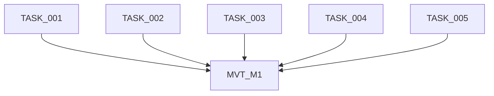
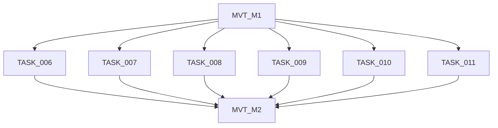
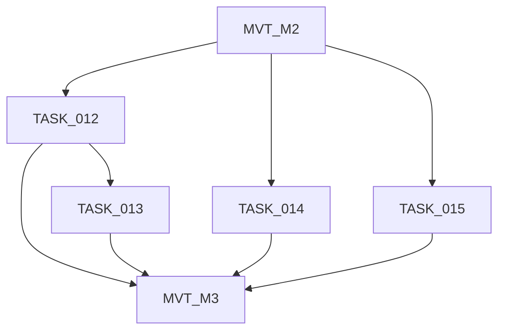
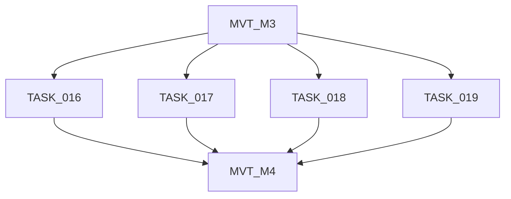
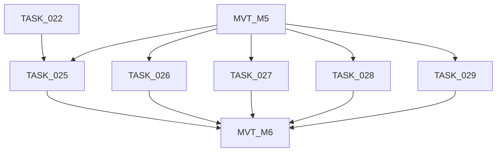
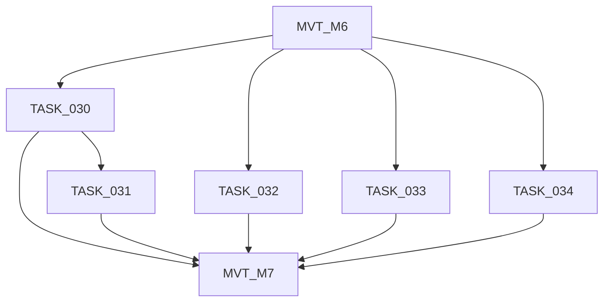
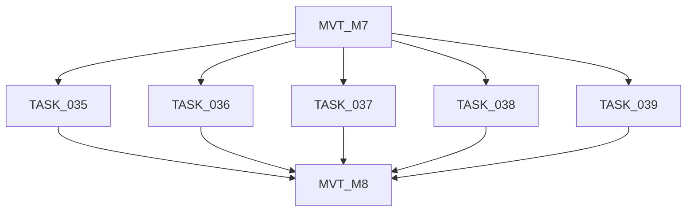
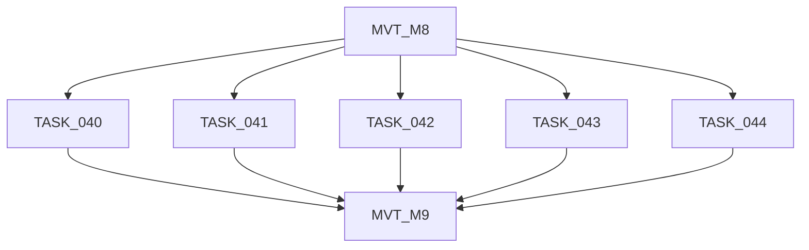

# Speci Codebase Refactoring — Implementation Progress

## Overview

| Property         | Value                                                                             |
| ---------------- | --------------------------------------------------------------------------------- |
| **Project Name** | Speci — AI-powered implementation loop orchestrator for GitHub Copilot            |
| **Plan File**    | docs/REFACTORING_PLAN.md                                                          |
| **Total Tasks**  | 44 tasks + 9 MVTs (53 files total)                                                |
| **Tech Stack**   | TypeScript, ES modules, strict TS, Commander.js, Vitest, DI via CommandContext    |

---

## Status Legend

| Marker      | Meaning                          |
| ----------- | -------------------------------- |
| COMPLETE    | Task finished and verified       |
| IN PROGRESS | Currently being worked on        |
| IN REVIEW   | Work complete, awaiting review   |
| NOT STARTED | Task not yet begun               |
| BLOCKED     | Waiting on dependency completion |

---

## Progress Summary

| Milestone | Name                                   | Tasks   | MVT    | Complete | Total | Status      |
| --------- | -------------------------------------- | ------- | ------ | -------- | ----- | ----------- |
| M1        | Safety & Error Handling                | 001-005 | MVT_M1 | 5        | 6     | IN PROGRESS |
| M2        | DI Foundation & Quick Wins             | 006-011 | MVT_M2 | 6        | 7     | IN PROGRESS |
| M3        | Run-Loop Safety & Status Decomposition | 012-015 | MVT_M3 | 1        | 5     | IN PROGRESS |
| M4        | Prompt Infrastructure & DRY            | 016-019 | MVT_M4 | 4        | 5     | IN PROGRESS |
| M5        | Testability & Config Loading           | 020-024 | MVT_M5 | 0        | 6     | NOT STARTED |
| M6        | DI Completions & Function Decomposition| 025-029 | MVT_M6 | 0        | 6     | NOT STARTED |
| M7        | Singleton Encapsulation & Logging      | 030-034 | MVT_M7 | 0        | 6     | NOT STARTED |
| M8        | Type Safety & Naming                   | 035-039 | MVT_M8 | 0        | 6     | NOT STARTED |
| M9        | Code Quality & Architecture Cleanup    | 040-044 | MVT_M9 | 0        | 6     | NOT STARTED |

---

## Milestone: M1 — Safety & Error Handling

| Task ID  | Title                                          | File                                  | Status      | Review Status | Priority | Complexity | Dependencies                        | Assigned To | Attempts |
| -------- | ---------------------------------------------- | ------------------------------------- | ----------- | ------------- | -------- | ---------- | ----------------------------------- | ----------- | -------- |
| TASK_001 | Fix Non-Atomic writeFailureNotes               | TASK_001_fix_nonatom_write.md         | COMPLETE    | PASSED        | MEDIUM   | M          | None                                | SA-20260302-001 | 1        |
| TASK_002 | Fix Fatal Error Handler + unhandledRejection   | TASK_002_fix_fatal_error_handler.md   | COMPLETE    | PASSED        | MEDIUM   | M          | None                                | SA-20260302-002 | 1        |
| TASK_003 | Fix Error-Code Detection via error.name        | TASK_003_fix_error_code_detection.md  | COMPLETE    | PASSED        | MEDIUM   | M          | None                                | SA-20260302-003 | 1        |
| TASK_004 | Fix Unsafe Error Cast in copilot.ts            | TASK_004_fix_unsafe_error_cast.md     | COMPLETE    | PASSED        | MEDIUM   | M          | None                                | SA-20260302-004 | 1        |
| TASK_005 | Fix Cleanup Handler Double-Registration        | TASK_005_fix_cleanup_double_reg.md    | COMPLETE    | PASSED        | MEDIUM   | M          | None                                | SA-20260302-005 | 1        |
| MVT_M1   | Manual Verification: Safety & Error Handling   | MVT_M1_safety_error_handling.md       | NOT STARTED | —             | —        | 30 min     | TASK_001, TASK_002, TASK_003, TASK_004, TASK_005 | | |

### Dependencies


```mermaid
graph TD
    T001[TASK_001] --> MVT1[MVT_M1]
    T002[TASK_002] --> MVT1
    T003[TASK_003] --> MVT1
    T004[TASK_004] --> MVT1
    T005[TASK_005] --> MVT1
```

---

## Milestone: M2 — DI Foundation & Quick Wins

| Task ID  | Title                                          | File                                          | Status      | Review Status | Priority | Complexity | Dependencies | Assigned To | Attempts |
| -------- | ---------------------------------------------- | --------------------------------------------- | ----------- | ------------- | -------- | ---------- | ------------ | ----------- | -------- |
| TASK_006 | Remove createProductionContext Default Params  | TASK_006_remove_default_context_params.md     | COMPLETE    | PASSED        | MEDIUM   | M          | MVT_M1       | SA-20260302-006 | 1        |
| TASK_007 | Hoist VALID_STATUSES to Module-Level Const     | TASK_007_hoist_valid_statuses.md              | COMPLETE    | PASSED        | MEDIUM   | M          | MVT_M1       | SA-20260302-007 | 1        |
| TASK_008 | Memoize supportsColor() at Module Load         | TASK_008_memoize_supports_color.md            | COMPLETE    | PASSED        | MEDIUM   | M          | MVT_M1       | SA-20260302-008 | 1        |
| TASK_009 | Replace TOCTOU existsSync+readFile Pattern     | TASK_009_replace_toctou_read.md               | COMPLETE    | PASSED        | MEDIUM   | M          | MVT_M1       | SA-20260302-009 | 1        |
| TASK_010 | Add MESSAGES Constant + writeLogEntry Helper   | TASK_010_add_messages_constant_log_helper.md  | COMPLETE    | PASSED        | MEDIUM   | M          | MVT_M1       | SA-20260302-010 | 1        |
| TASK_011 | Fix README STATE Enum Conflation               | TASK_011_fix_readme_state_conflation.md       | COMPLETE    | PASSED        | MEDIUM   | M          | MVT_M1       | SA-20260302-011 | 1        |
| MVT_M2   | Manual Verification: DI Foundation & Quick Wins| MVT_M2_di_foundation_quick_wins.md            | NOT STARTED | —             | —        | 30 min     | TASK_006, TASK_007, TASK_008, TASK_009, TASK_010, TASK_011 | | |

### Dependencies


```mermaid
graph TD
    MVT1[MVT_M1] --> T006[TASK_006]
    MVT1 --> T007[TASK_007]
    MVT1 --> T008[TASK_008]
    MVT1 --> T009[TASK_009]
    MVT1 --> T010[TASK_010]
    MVT1 --> T011[TASK_011]
    T006 --> MVT2[MVT_M2]
    T007 --> MVT2
    T008 --> MVT2
    T009 --> MVT2
    T010 --> MVT2
    T011 --> MVT2
```

---

## Milestone: M3 — Run-Loop Safety & Status Decomposition

| Task ID  | Title                                              | File                                        | Status      | Review Status | Priority | Complexity | Dependencies          | Assigned To | Attempts |
| -------- | -------------------------------------------------- | ------------------------------------------- | ----------- | ------------- | -------- | ---------- | --------------------- | ----------- | -------- |
| TASK_012 | Add isTaskStatus Type Predicate                    | TASK_012_add_task_status_type_guard.md      | COMPLETE    | PASSED        | MEDIUM   | M          | MVT_M2                | SA-20260302-012 | 1        |
| TASK_013 | Replace Regex getState() with Column-Parsing       | TASK_013_replace_regex_getstate.md          | COMPLETE    | PASSED        | MEDIUM   | M          | MVT_M2, TASK_012      | SA-20260302-013 | 1        |
| TASK_014 | Decompose runLiveDashboard into Injectable Helpers | TASK_014_decompose_run_live_dashboard.md    | COMPLETE    | PASSED        | MEDIUM   | M          | MVT_M2                | SA-20260302-014 | 1        |
| TASK_015 | Extract renderLockSection from status.ts           | TASK_015_extract_render_lock_section.md     | COMPLETE    | PASSED        | MEDIUM   | M          | MVT_M2                | SA-20260302-015 | 1        |
| MVT_M3   | Manual Verification: Run-Loop Safety & Status      | MVT_M3_run_loop_safety_status_decomposition.md | NOT STARTED | —          | —        | 30 min     | TASK_012, TASK_013, TASK_014, TASK_015 | | |

### Dependencies


```mermaid
graph TD
    MVT2[MVT_M2] --> T012[TASK_012]
    MVT2 --> T014[TASK_014]
    MVT2 --> T015[TASK_015]
    T012 --> T013[TASK_013]
    T012 --> MVT3[MVT_M3]
    T013 --> MVT3
    T014 --> MVT3
    T015 --> MVT3
```

---

## Milestone: M4 — Prompt Infrastructure & DRY

| Task ID  | Title                                              | File                                              | Status      | Review Status | Priority | Complexity | Dependencies | Assigned To | Attempts |
| -------- | -------------------------------------------------- | ------------------------------------------------- | ----------- | ------------- | -------- | ---------- | ------------ | ----------- | -------- |
| TASK_016 | Extract promptUser Utility + isYesAnswer Helper    | TASK_016_extract_prompt_user_utility.md           | COMPLETE    | PASSED        | MEDIUM   | M          | MVT_M3       | SA-20260302-016 | 1        |
| TASK_017 | Extract parseProgressLines + computeMvtReadiness   | TASK_017_extract_parse_progress_lines.md          | COMPLETE    | PASSED        | MEDIUM   | M          | MVT_M3       | SA-20260302-017 | 1        |
| TASK_018 | Extract validateCleanPreconditions from clean.ts   | TASK_018_extract_validate_clean_preconditions.md  | COMPLETE    | PASSED        | MEDIUM   | M          | MVT_M3       | SA-20260302-018 | 1        |
| TASK_019 | Add SIGKILL Fallback in Gate Timeout Handler       | TASK_019_add_sigkill_fallback.md                  | COMPLETE    | PASSED        | MEDIUM   | M          | MVT_M3       | SA-20260302-019 | 1        |
| MVT_M4   | Manual Verification: Prompt Infrastructure & DRY   | MVT_M4_prompt_infrastructure_dry.md               | NOT STARTED | —             | —        | 30 min     | TASK_016, TASK_017, TASK_018, TASK_019 | | |

### Dependencies


```mermaid
graph TD
    MVT3[MVT_M3] --> T016[TASK_016]
    MVT3 --> T017[TASK_017]
    MVT3 --> T018[TASK_018]
    MVT3 --> T019[TASK_019]
    T016 --> MVT4[MVT_M4]
    T017 --> MVT4
    T018 --> MVT4
    T019 --> MVT4
```

---

## Milestone: M5 — Testability & Config Loading

| Task ID  | Title                                          | File                                        | Status      | Review Status | Priority | Complexity | Dependencies | Assigned To | Attempts |
| -------- | ---------------------------------------------- | ------------------------------------------- | ----------- | ------------- | -------- | ---------- | ------------ | ----------- | -------- |
| TASK_020 | Lazy Config Loading in CommandRegistry         | TASK_020_lazy_config_loading.md             | COMPLETE    | PASSED        | MEDIUM   | M          | MVT_M4       | SA-20260302-020 | 1        |
| TASK_021 | Test Coverage for promptForce/confirmRun       | TASK_021_test_prompt_functions.md           | COMPLETE    | PASSED        | MEDIUM   | M          | MVT_M4       | SA-20260302-021 | 1        |
| TASK_022 | Add run.integration.test.ts                    | TASK_022_run_integration_test.md            | COMPLETE    | PASSED        | MEDIUM   | M          | MVT_M4       | SA-20260302-023 | 2        |
| TASK_023 | Add status/clean Integration Tests             | TASK_023_status_clean_integration_tests.md  | COMPLETE    | PASSED        | MEDIUM   | M          | MVT_M4       | SA-20260302-024 | 1        |
| TASK_024 | Cover signals.ts .then/.catch Callbacks        | TASK_024_signals_then_catch_coverage.md     | COMPLETE    | PASSED        | MEDIUM   | M          | MVT_M4       | SA-20260302-025 | 1        |
| MVT_M5   | Manual Verification: Testability & Config      | MVT_M5_testability_config_loading.md        | NOT STARTED | —             | —        | 30 min     | TASK_020, TASK_021, TASK_022, TASK_023, TASK_024 | | |

### Dependencies


```mermaid
graph TD
    MVT4[MVT_M4] --> T020[TASK_020]
    MVT4 --> T021[TASK_021]
    MVT4 --> T022[TASK_022]
    MVT4 --> T023[TASK_023]
    MVT4 --> T024[TASK_024]
    T020 --> MVT5[MVT_M5]
    T021 --> MVT5
    T022 --> MVT5
    T023 --> MVT5
    T024 --> MVT5
```

---

## Milestone: M6 — DI Completions & Function Decomposition

| Task ID  | Title                                              | File                                                              | Status      | Review Status | Priority | Complexity | Dependencies          | Assigned To | Attempts |
| -------- | -------------------------------------------------- | ----------------------------------------------------------------- | ----------- | ------------- | -------- | ---------- | --------------------- | ----------- | -------- |
| TASK_025 | Thread IFileSystem Through loadConfig/preflight    | TASK_025_thread_ifilesystem_loadconfig_preflight.md               | COMPLETE    | PASSED        | MEDIUM   | M          | MVT_M5, TASK_022      | SA-20260302-026 | 1        |
| TASK_026 | Add proc?: IProcess to copilot.ts runAgent         | TASK_026_add_iprocess_to_copilot.md                               | COMPLETE    | PASSED        | MEDIUM   | M          | MVT_M5                | SA-20260302-027 | 1        |
| TASK_027 | Validate Bundled Config + Typed applyMapping       | TASK_027_validate_bundled_config_typed_applyMapping.md            | COMPLETE    | PASSED        | MEDIUM   | M          | MVT_M5                | SA-20260302-028 | 1        |
| TASK_028 | Extract renderStatsBox, runYoloPipeline, decouple confirmRun | TASK_028_extract_renderstatsbox_runyolopipeline_decouple_confirmrun.md | COMPLETE | PASSED | MEDIUM | M     | MVT_M5                | SA-20260302-029 | 1        |
| TASK_029 | Add optional fs?: IFileSystem to readStateFile     | TASK_029_add_optional_fs_to_readstatefile.md                      | COMPLETE    | PASSED        | MEDIUM   | M          | MVT_M5                | SA-20260302-030 | 1        |
| MVT_M6   | Manual Verification: DI Completions & Decomposition| MVT_M6_di_completions_function_decomposition.md                   | NOT STARTED | —             | —        | 30 min     | TASK_025, TASK_026, TASK_027, TASK_028, TASK_029 | | |

### Dependencies


```mermaid
graph TD
    MVT5[MVT_M5] --> T025[TASK_025]
    MVT5 --> T026[TASK_026]
    MVT5 --> T027[TASK_027]
    MVT5 --> T028[TASK_028]
    MVT5 --> T029[TASK_029]
    T022[TASK_022] --> T025
    T025 --> MVT6[MVT_M6]
    T026 --> MVT6
    T027 --> MVT6
    T028 --> MVT6
    T029 --> MVT6
```

---

## Milestone: M7 — Singleton Encapsulation & Logging Unification

| Task ID  | Title                                              | File                                                        | Status      | Review Status | Priority | Complexity | Dependencies          | Assigned To | Attempts |
| -------- | -------------------------------------------------- | ----------------------------------------------------------- | ----------- | ------------- | -------- | ---------- | --------------------- | ----------- | -------- |
| TASK_030 | SignalManager Pre-Condition Integration Test       | TASK_030_signal_manager_precondition_integration_test.md    | COMPLETE    | PASSED        | MEDIUM   | M          | MVT_M6                | SA-20260302-031 | 1        |
| TASK_031 | Encapsulate signals.ts in SignalManager Class      | TASK_031_signal_manager_class.md                            | COMPLETE    | PASSED        | MEDIUM   | M          | MVT_M6, TASK_030      | SA-20260302-032 | 1        |
| TASK_032 | Add IProcess to installSignalHandlers              | TASK_032_iprocess_in_signal_handlers.md                     | COMPLETE    | PASSED        | MEDIUM   | M          | MVT_M6                | SA-20260302-032 | 1        |
| TASK_033 | Encapsulate stateFileCache in StateCache Class     | TASK_033_state_cache_class.md                               | COMPLETE    | PASSED        | MEDIUM   | M          | MVT_M6                | SA-20260302-033 | 1        |
| TASK_034 | Thread ILogger Through Infrastructure Functions    | TASK_034_ilogger_in_infrastructure_functions.md             | COMPLETE    | PASSED        | MEDIUM   | M          | MVT_M6                | SA-20260302-034 | 1        |
| MVT_M7   | Manual Verification: Singleton & Logging           | MVT_M7_singleton_encapsulation_logging_unification.md       | NOT STARTED | —             | —        | 30 min     | TASK_030, TASK_031, TASK_032, TASK_033, TASK_034 | | |

### Dependencies


```mermaid
graph TD
    MVT6[MVT_M6] --> T030[TASK_030]
    MVT6 --> T032[TASK_032]
    MVT6 --> T033[TASK_033]
    MVT6 --> T034[TASK_034]
    T030 --> T031[TASK_031]
    T030 --> MVT7[MVT_M7]
    T031 --> MVT7
    T032 --> MVT7
    T033 --> MVT7
    T034 --> MVT7
```

---

## Milestone: M8 — Type Safety & Naming

| Task ID  | Title                                              | File                                                    | Status      | Review Status | Priority | Complexity | Dependencies | Assigned To | Attempts |
| -------- | -------------------------------------------------- | ------------------------------------------------------- | ----------- | ------------- | -------- | ---------- | ------------ | ----------- | -------- |
| TASK_035 | Type Safety Batch (TYPE-05–TYPE-09)                | TASK_035_type_safety_small_fixes_batch.md               | COMPLETE    | PASSED        | MEDIUM   | M          | MVT_M7       | SA-20260302-035 | 1        |
| TASK_036 | Fix Mock Stream Types + Agent Result Factories     | TASK_036_fix_mock_stream_types_agent_result_factories.md| COMPLETE    | PASSED        | MEDIUM   | M          | MVT_M7       | SA-20260302-036 | 1        |
| TASK_037 | ENV Constants + Boolean Naming                     | TASK_037_env_constants_boolean_naming.md                | COMPLETE    | PASSED        | MEDIUM   | M          | MVT_M7       | SA-20260302-037 | 1        |
| TASK_038 | Function & Type Renaming Batch                     | TASK_038_function_type_renaming_batch.md                | COMPLETE    | PASSED        | MEDIUM   | M          | MVT_M7       | SA-20260302-038 | 1        |
| TASK_039 | Minor Error Handling Fixes (ERR-02, ERR-06, ERR-08)| TASK_039_minor_error_handling_fixes.md                  | COMPLETE    | PASSED        | MEDIUM   | M          | MVT_M7       | SA-20260302-039 | 1        |
| MVT_M8   | Manual Verification: Type Safety & Naming          | MVT_M8_type_safety_naming.md                            | NOT STARTED | —             | —        | 30 min     | TASK_035, TASK_036, TASK_037, TASK_038, TASK_039 | | |

### Dependencies


```mermaid
graph TD
    MVT7[MVT_M7] --> T035[TASK_035]
    MVT7 --> T036[TASK_036]
    MVT7 --> T037[TASK_037]
    MVT7 --> T038[TASK_038]
    MVT7 --> T039[TASK_039]
    T035 --> MVT8[MVT_M8]
    T036 --> MVT8
    T037 --> MVT8
    T038 --> MVT8
    T039 --> MVT8
```

---

## Milestone: M9 — Code Quality & Architecture Cleanup

| Task ID  | Title                                              | File                                          | Status      | Review Status | Priority | Complexity | Dependencies | Assigned To | Attempts |
| -------- | -------------------------------------------------- | --------------------------------------------- | ----------- | ------------- | -------- | ---------- | ------------ | ----------- | -------- |
| TASK_040 | DRY Helpers: failValidation, runPhase, phaseSeparator | TASK_040_dry_helper_functions.md           | IN REVIEW   | —             | MEDIUM   | M          | MVT_M8       | SA-20260302-040 | 1        |
| TASK_041 | Function Design Improvements Batch                 | TASK_041_function_design_improvements.md      | NOT STARTED | —             | MEDIUM   | M          | MVT_M8       |             |          |
| TASK_042 | Cross-Cutting Small Fixes (CC-06–CC-08)            | TASK_042_crosscutting_small_fixes.md          | NOT STARTED | —             | MEDIUM   | M          | MVT_M8       |             |          |
| TASK_043 | Remove utils/ and config/interfaces Shim Files     | TASK_043_remove_shim_files.md                 | NOT STARTED | —             | MEDIUM   | M          | MVT_M8       |             |          |
| TASK_044 | Test Coverage + Injectable Lock/State Fixes        | TASK_044_test_coverage_injectable_fixes.md    | NOT STARTED | —             | MEDIUM   | M          | MVT_M8       |             |          |
| MVT_M9   | Manual Verification: Code Quality & Cleanup        | MVT_M9_code_quality_architecture_cleanup.md   | NOT STARTED | —             | —        | 30 min     | TASK_040, TASK_041, TASK_042, TASK_043, TASK_044 | | |

### Dependencies


```mermaid
graph TD
    MVT8[MVT_M8] --> T040[TASK_040]
    MVT8 --> T041[TASK_041]
    MVT8 --> T042[TASK_042]
    MVT8 --> T043[TASK_043]
    MVT8 --> T044[TASK_044]
    T040 --> MVT9[MVT_M9]
    T041 --> MVT9
    T042 --> MVT9
    T043 --> MVT9
    T044 --> MVT9
```

---

## Completed Milestones

> Summary only. See task files for details.
> **On initial generation, this section is empty — no implementation work has been done yet.**

| Milestone | Name | Completed | Notes  |
| --------- | ---- | --------- | ------ |
| (none)    | —    | —         | —      |

---

## Critical Path

```
TASK_001–005 → MVT_M1
→ TASK_006–011 → MVT_M2
→ TASK_012 → TASK_013 (TYPE-04 strict prerequisite for STATE-05), TASK_014, TASK_015 → MVT_M3
→ TASK_016–019 → MVT_M4
→ TASK_020–024 (TASK_022 must be green before M6) → MVT_M5
→ TASK_025 (depends on TASK_022), TASK_026–029 → MVT_M6
→ TASK_030 → TASK_031 (gate), TASK_032–034 → MVT_M7
→ TASK_035–039 → MVT_M8
→ TASK_040–044 → MVT_M9
```

**Estimated remaining**: ~44 tasks × ~2–4h = ~100–180 hours of implementation + 9 MVT review sessions

---

## Risk Areas

| Task     | Risk                                              | Mitigation                                   |
| -------- | ------------------------------------------------- | -------------------------------------------- |
| TASK_013 | State parsing regression if column format varies | Requires TASK_012 type predicate first       |
| TASK_022 | Integration test flakiness with real subprocess  | Use temp dirs + controlled fixture state     |
| TASK_025 | IFileSystem threading may ripple across modules  | Gate on TASK_022 green before starting       |
| TASK_031 | SignalManager class refactor breaks global state | TASK_030 pre-condition test is mandatory gate|
| TASK_043 | Shim removal may break downstream imports        | Run full typecheck + test suite after        |

---

## Plan Coverage

| Category | Covered | Total | Missing                        |
| -------- | ------- | ----- | ------------------------------ |
| ARCH     | 4       | 6     | ARCH-05, ARCH-06               |
| CC       | 8       | 8     | —                              |
| DUP      | 9       | 9     | —                              |
| ERR      | 9       | 9     | —                              |
| FUN      | 9       | 10    | FUN-10                         |
| NAME     | 12      | 12    | —                              |
| PERF     | 4       | 5     | PERF-05                        |
| STATE    | 7       | 7     | —                              |
| TEST     | 10      | 12    | TEST-01, TEST-07               |
| TYPE     | 10      | 10    | —                              |
| **Total**| **82**  | **88**| ARCH-05, ARCH-06, FUN-10, PERF-05, TEST-01, TEST-07 |

> Note: 6 plan IDs (ARCH-05, ARCH-06, FUN-10, PERF-05, TEST-01, TEST-07) are not addressed by current tasks. These were assessed as lower priority or deferred. See REFACTORING_PLAN.md for details.

---

## Subagent Tracking

Last Subagent ID: SA-20260302-040

---

## Review Tracking

Last Review ID: RA-20260302-040

---

## Agent Handoff

### For Reviewer

| Field             | Value |
| ----------------- | ----- |
| Task              | TASK_040 |
| Impl Agent        | SA-20260302-040 |
| Files Changed     | `lib/utils/infrastructure/error-handler.ts`, `lib/commands/task.ts`, `lib/commands/refactor.ts`, `lib/commands/plan.ts` |
| Tests Added       | `test/utils/infrastructure/error-handler.test.ts` (2 new tests) |
| Rework?           | No |
| Focus Areas       | failValidation helper behavior parity at task/refactor/plan validation failure call sites |
| Known Limitations | DUP-08/DUP-09 not modified because TASK_028 is already COMPLETE/PASSED in progress tracking |
| Gate Results      | format:✅ lint:✅ typecheck:✅ test:✅ |

### For Fix Agent

| Field           | Value |
| --------------- | ----- |
| Task            | - |
| Task Goal       | - |
| Review Agent    | - |
| Failed Gate     | - |
| Primary Error   | - |
| Root Cause Hint | - |
| Do NOT          | - |

### Review Failure Notes

None.


